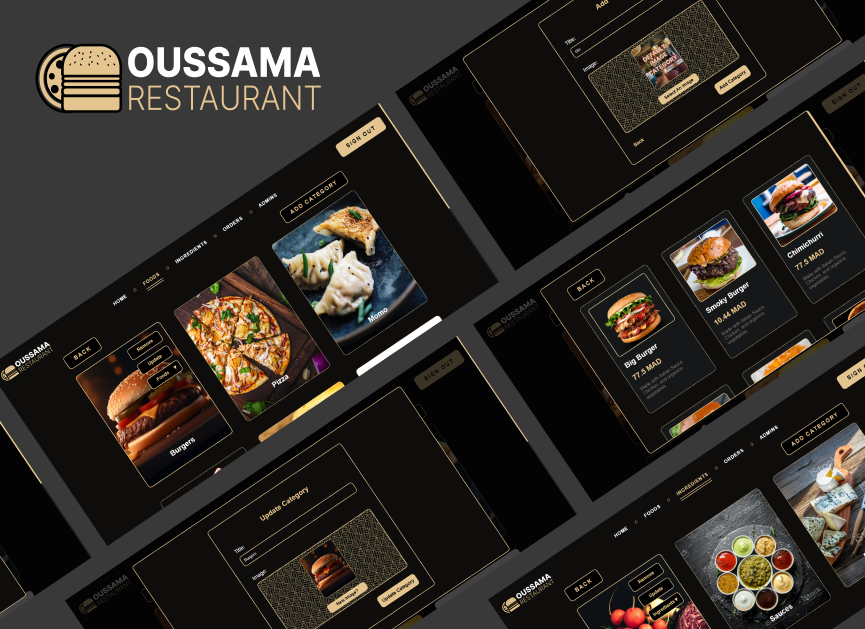

# Restaurant Management Web Application

## 📝 Description

This web application provides complete management of a restaurant through two distinct platforms:

- **Customer Platform**: Allows customers to browse the menu, place orders online, and track their order status.
- **Admin Platform**: Enables the admin to manage the menu, orders, users, and view statistics.

## 🚀 Features

### Customer Platform
- 🛒 Browse the menu and add dishes to the cart
- 📦 Place an order online
- 🔍 Track order status
- 💬 Leave reviews on dishes

### Admin Platform
- 📋 Manage menu categories and dishes
- 📊 Track orders and sales
- 👥 Manage customers and admins
- ⚙️ Configure restaurant settings

## 🏗️ Technologies Used

- **Backend**: PHP
- **Frontend**: HTML, CSS, JavaScript
- **Database**: MySQL
- **Version Control**: Git, GitHub

## 🖼️ Screenshots

